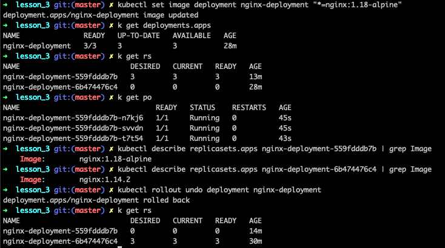

# Basic abstracitons: Deployment

## Definition:

Deployment can be presented as a parent for ReplicaSet.
As we know from lesson_2 ReplicaSet is created maintain defined number of Pod's. However it doesn't have a functionality to update Pod's when configuration is changed.
For this reason was created Deployment.
In Deployment you describe a desired state, and the Deployment Controller changes the actual state to the desired state at a controlled rate. In ther words it guaranties that your application will not go in downtime during updates.

## Template
### Related fields
- spec.strategy - strategy for ReplicaSet updates


## Practice log
- create demo deployment.
```
# create deployment from file
$ kubectl create -f 1_quick_start_deployment.yaml

# check that deployment was created
$ kubectl get deployments.apps 
# or
$ kubectl get deploy

# check that replica was created and it has desirec count of replicas
$ kubectl get rs

# check that you have desired count of Pod's replicas.
$ kubectl get po

# notice names. Pod's names inherit ReplicaSet name which at it's point Deployment name.
```

- update deployments
```
# update image version in your deployment
$ kubectl set image deployment nginx-deployment "*=nginx:1.18-alpine"

# check that deployment is "Up to date"
$ kubectl get deployments.apps

# check deployment image version
$ kubectl describe deployments.apps nginx-deployment | grep Image

# check replicas. Notice that you have two replicas now. 
# One is currently running ReplicaSet and second is backup for previous.
$ kubectl get rs

# You can verify this by checking image version for both replicas
$ kubectl describe replicasets.apps nginx-deployment-<current_replica_set_hash> | grep Image
$ kubectl describe replicasets.apps nginx-deployment-<backup_replica_set_hash> | grep Image

# Check Pod's to be sure that it's with updated version
$ kubectl get po
$ kubectl describe pod nginx-deployment-<hash> | grep Image
```

- rollback deployments.
From previous section you learned how to update Pod's through Deployments and Replica sets. As same as you noticed that Kubernetes preserve ReplicaSets as backup. By using folowing command we can use backup for rollback.
```
# Check existing ReplicaSets
$ kubectl get rs

# Get image versions from both ReplicaSets.
$ kubectl describe replicasets.apps nginx-deployment-<current_replica_set_hash> | grep Image
$ kubectl describe replicasets.apps nginx-deployment-<backup_replica_set_hash> | grep Image

# Execute rollback
$ kubectl rollout undo deployment nginx-deployment

# Check current deployment image version
$ kubectl describe deployments.apps nginx-deployment | grep Image

# Check replica sets. Notice that now active old ReplicaSet version.
$ kubectl get rs
```

- update and rollback console output


## Notes
### New commands
- kubectl set - These commands help you make changes to existing application resources - (https://kubernetes.io/docs/reference/generated/kubectl/kubectl-commands#set)
- kubectl set image - Update existing container image(s) of resources.

### Shortcuts
- deployments => deploy